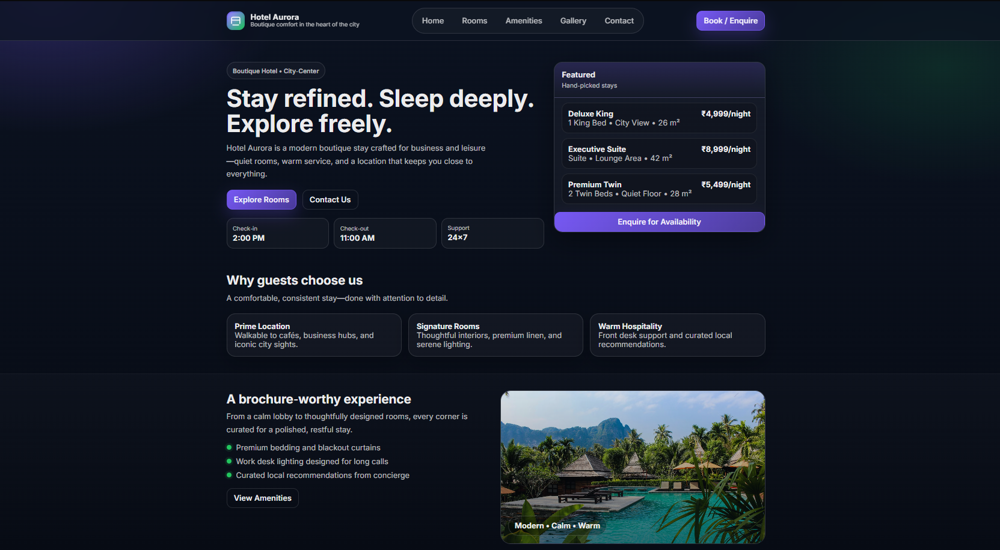
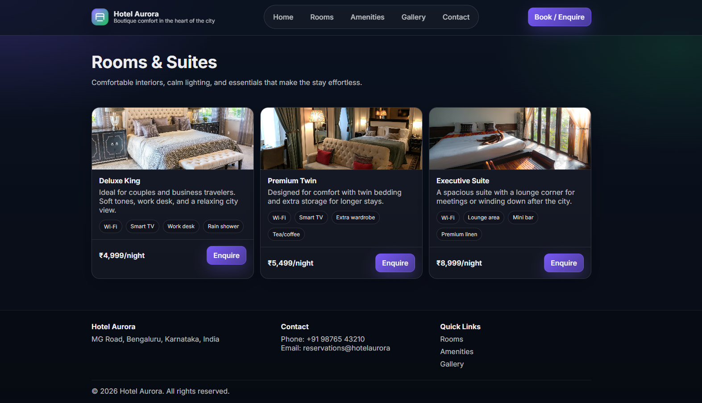

# Hotel Brochure Website (Django)

A modern, responsive **hotel brochure website** built with **Django**. It includes a polished UI, multiple brochure-style pages (Home/Rooms/Amenities/Gallery/Contact), and a simple enquiry form.

This project is ideal for:
- Students learning Django templating and static files
- A quick portfolio/demo website
- A starter for a real hotel website (swap in your own images/content)

---

## Features

- **Professional UI**
  - Modern brochure layout
  - Responsive design (works on mobile + desktop)
  - Clean typography and consistent components
- **Pages included**
  - Home
  - Rooms
  - Amenities
  - Gallery
  - Contact (enquiry form)
- **Contact form**
  - Uses Django messages to show success/error feedback
  - Lightweight (no database model needed)
- **Static assets support**
  - CSS and images served via Django static files

---

## Tech Stack

- **Python**: 3.12 (recommended)
- **Django**: 6.0.x
- **Frontend**: Django Templates + CSS
- **Database**: SQLite (default, for Django admin/session apps)

---

## Project Structure

```text
Hotel-Brochure/
  brochure/                  # Django app (views + urls)
  hotel_site/                # Django project settings
  templates/brochure/        # HTML templates
  static/brochure/           # CSS and images
  db.sqlite3                 # SQLite database
  manage.py                  # Django entrypoint
```

Key files you’ll likely edit:
- `brochure/views.py` (site content: hotel name, rooms list, gallery images)
- `templates/brochure/*.html` (page layout)
- `static/brochure/css/site.css` (styling)

---

## Installation & Setup (Windows)

### 1) Create and activate a virtual environment (recommended)

```powershell
python -m venv .venv
.\.venv\Scripts\activate
```

### 2) Install dependencies

```powershell
pip install "Django>=6.0,<6.1"
```

### 3) Run migrations

```powershell
python manage.py migrate
```

### 4) Start the development server

```powershell
python manage.py runserver
```

Open:
- `http://127.0.0.1:8000/`

---

## Running with a specific Python version (important)

If you have multiple Python versions installed, make sure you run the project with the same Python where Django is installed.

Example (Windows launcher):

```powershell
py -3.12 manage.py runserver
```

If you see:

```text
ModuleNotFoundError: No module named 'django'
```

It means you’re using a Python interpreter that doesn’t have Django installed.

---

## How to Use

- **Home**: landing section + highlights + brochure-style experience section
- **Rooms**: displays room cards, pricing, and features
- **Gallery**: displays a grid of images
- **Contact**: send an enquiry message (shows success/error message)

---

## Customization

### Update hotel details
Edit `_site_context()` in:
- `brochure/views.py`

You can change:
- Hotel name
- Tagline
- Contact number/email
- Address

### Update room cards / gallery images
Edit:
- `rooms()` and `gallery()` in `brochure/views.py`

### Replace images with your own
Best approach:
1. Put your images into:
   - `static/brochure/img/...`
2. Reference them from templates using:
   - ``
   - ``

---

## Troubleshooting

### Static CSS/images not loading
Confirm in `hotel_site/settings.py`:
- `STATIC_URL = '/static/'`
- `STATICFILES_DIRS` includes `BASE_DIR / 'static'`

Then restart the server.

### Port already in use
Run on another port:

```powershell
python manage.py runserver 8001
```

---

## Screenshots

Add your screenshots to the repository and link them here, for example:

```md


```

---

## License

This project is released under the license in `LICENSE`.

